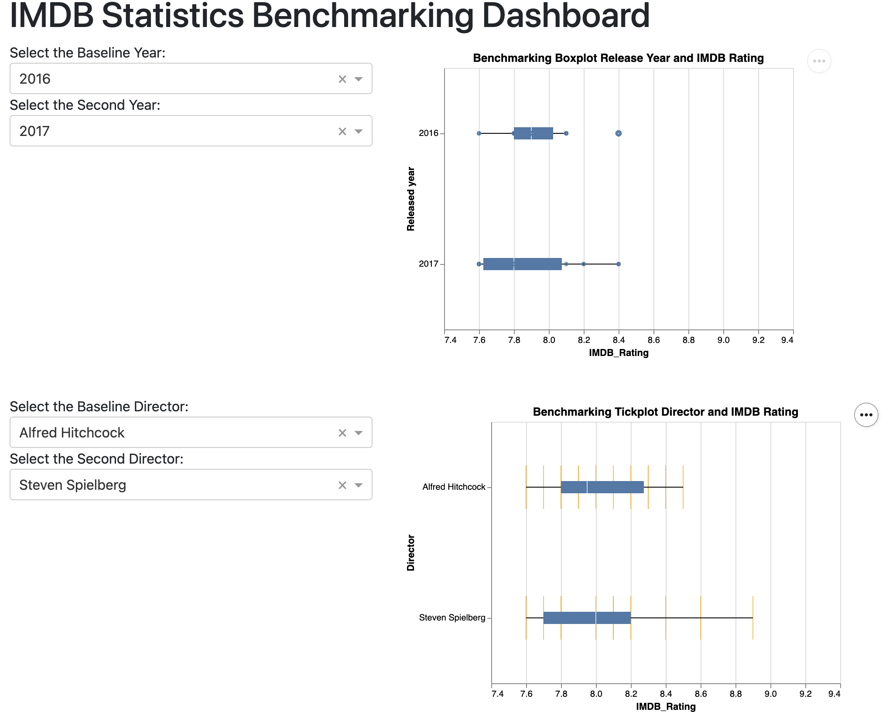

# IMDB_viz_python

Welcome everyone and thank you for visiting the `IMDB_Viz_py` project repository!

If you love great movies and need some help figuring out which one to watch next, then you've come to the right place as our app is exactly what you need!

[Link to the IMDB_Viz_py Dash App via Render](https://dashapp-imdb-viz-py.onrender.com)

To read more about our wonderful app, feel free to jump over to one of the sections below or continue scrolling down.

- [Motivation and Purpose](#motivation-and-purpose)
- [Usage](#usage)
- [Installation](#installation)
- [Contributing](#contributing)
- [Description of the data](#description-of-the-data-and-reference)
- [License](#license)

## Motivation and Purpose

Choosing a good movie to watch can be a struggle sometimes and there's almost nothing worse than realizing you just spent 2 hours sitting through a horrible movie that you didn't enjoy one bit. Our user-friendly and accessible dashboard aims to help movie enthusiasts avoid this problem by helping them discover and explore new movies based on their movie watching preferences. In addition, our dashboard uses a vast database of movies to provide users with information on ratings, runtimes, and movie numbers presented through engaging visuals based on various metrics they can select via an interactive and intuitive interface. Please check out [Proposal](https://github.com/UBC-MDS/IMDB_Viz_R/blob/main/reports/proposal.md) and [shiny app](https://arjunrk.shinyapps.io/IMDB_Viz_R/) of our R version. This Python version is a good complement of our R version and I choose to focus on comparing the distribution of IMDB ratings between two different movie directors and between two release years. 

## Usage

Besides the useful features of our original R shiny dashboard, this python dashboard includes text and interactive plots for users to easily benchmark the performance of two directors and overall yearly movie industry rating performances. The users can use the dropdown menu to select his interested baseline year and then choose his second year to make the comparison for the IMDB ratings. The results will show the distribution of IMDB ratings across these two different years in a jitter point plot along with the boxplot overlayed. In addition, the users can also use the dropdown menu to select his targeted two diretors and compare the performance of their movie productions based on IMDB ratings. 
The results will show the distribution of IMDB ratings across these two different directors in a bar tick plot along with the boxplot overlayed. 

## Installation

To start off, fork the repo from <https://github.com/yukunzGIT/IMDB_Viz_py.git> and clone the forked repo to your local machine in [VScode](https://posit.co/download/rstudio-desktop/) by running:

`git clone https://github.com/[Your-GitHub-Page]/IMDB_Viz_py.git`

Navigate to the folder and run the following in terminal to create and activate conda environment:

`conda env create --file dataviz-532.yaml`

`conda activate dataviz-532`

In the root directory of IMDB_Viz_py folder, run `cd src`,

then run `python app.py` to deploy the app locally.

## Contributing

Interested in contributing? Check out the [contributing guidelines](https://github.com/yukunzGIT/IMDB_Viz_py/blob/main/CONTRIBUTING.md). Please note that this project is released with a [Code of Conduct](https://github.com/yukunzGIT/IMDB_Viz_py/blob/main/CODE_OF_CONDUCT.md). By contributing to this project, you agree to abide by its terms.

## Description of the data and reference

For the dashboard, we're sourcing the data from Kaggle, which is a well-known platform for data science and machine learning projects. It can be accessed [here](https://www.kaggle.com/datasets/harshitshankhdhar/imdb-dataset-of-top-1000-movies-and-tv-shows). The dataset contains 1000 observations of movie data with a compressive set of features. Some of the key features are the movie's title (Series_Title), the certificate issued (Certificate), release year (Released_Year), runtime (Runtime), genre (Genre), IMDB rating (IMDB_Rating), meta score (Meta_score), director (Director), star power (Star1, Star2, Star3, Star4), number of votes (No_of_votes), and box office earnings (Gross). The dataset also contains a summary of the movie (Overview) which allows the users to quickly understand if the story is something they would prefer or not. For this Python dashboard, I only extracted non null movies with selected cloumn of Released_Year, IMDB_Rating and Director. 

## License

`IMDB_Viz_py` was created by Yukun Edward Zhang. It is licensed under the terms of the MIT license.
